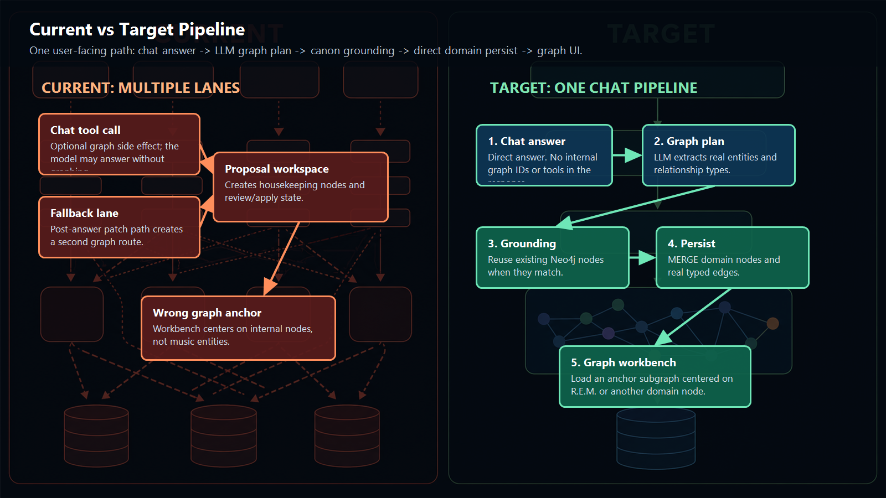
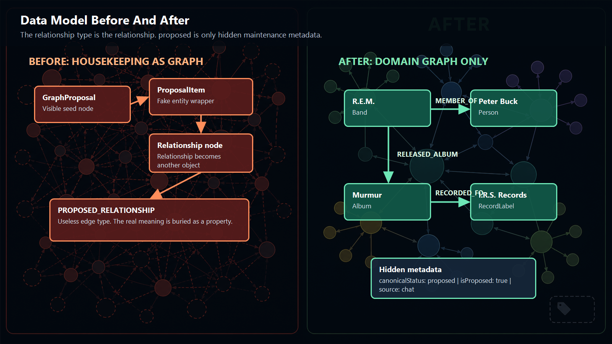
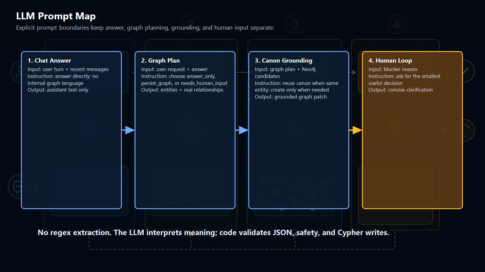

# One Chat Pipeline

MusicMesh has one user-facing graph creation path: chat.

## Runtime Flow



1. `POST /api/chat` receives the user's turn.
2. `chatService.createAssistantReply` returns the direct answer with no graph tools.
3. `graphChatOrchestrator.planGraphFromAnswer` asks the LLM whether the answer should produce graph data.
4. `graphChatOrchestrator.groundGraphPlan` asks the LLM to resolve planned entities against Neo4j candidates.
5. `graphDomainWriter.persistChatGraph` MERGEs domain nodes and real relationship types directly.
6. The graph workbench loads from `graphAnchorId`, which is a real music-domain node.
7. `runQualityAssessment` builds a compact operational packet from the prompt, assistant output, conversation tape, and runtime events, then asks the LLM to assess the completed run and writes a `run_quality_assessment` tape entry.

## Graph Workbench Behavior

The Graph tab is an inspection and comparison surface for graph results created through chat or loaded by seed search.

- Search loads a seed-centered graph.
- Chat focus loads the current answer's graph anchor when available.
- Double-clicking a node centers that node and loads its connected subgraph.
- `Expand` has the same centered-node behavior as double-click.
- `Back` and `Forward` redisplay graph payloads that have already been shown; they do not call the LLM or run new graph research.
- Dragging a node updates the current view layout only.

## Visible Model

The user sees only music-domain graph objects:

- node labels such as `Artist`, `Band`, `Album`, `Track`, `Person`, `RecordLabel`, `Scene`, `Venue`, `Genre`, and `Place`
- relationship types such as `MEMBER_OF`, `IS_A_TRACK_ON`, `RELEASED_ALBUM`, `PRODUCED_BY`, `ASSOCIATED_WITH_SCENE`, `LOCATED_IN`, and `INFLUENCED`

The relationship examples are not an allow-list. The graph planner may use a new uppercase snake_case relationship type when it describes a real music-domain relationship and the existing examples do not fit.

## Hidden Maintenance Metadata



New chat-persisted facts can carry housekeeping properties:

```json
{
  "canonicalStatus": "proposed",
  "isProposed": true,
  "source": "chat",
  "threadId": "...",
  "turnId": "...",
  "confidenceScore": 0.82,
  "evidenceBasis": "assistant_answer"
}
```

These properties are for offline maintenance. They must not appear as node kinds, relationship types, filters, workflow tabs, or review/apply UI.

When chat updates an existing node or relationship, the writer must not overwrite an existing `canonicalStatus` or `isProposed` flag. Those status fields are set only when the chat pipeline creates a new graph object. Existing canon can receive non-status update metadata such as `lastChatThreadId`, `lastChatTurnId`, and `lastChatSource`.

## Removed User-Facing Concepts

The operator app no longer exposes:

- proposal builder
- review/apply buttons
- `GraphProposal` seed nodes
- `ProposalItem`, `ProposedEntity`, or `ProposedRelationship` nodes
- `PROPOSED_RELATIONSHIP` edges

If graph staging is unsafe, the LLM asks the human for the smallest useful next decision instead of creating proposal scaffolding.

## LLM Prompt Map



## Reasoning Effort And Telemetry

Reasoning effort is configured by pipeline stage through environment variables, with `OPENAI_REASONING_EFFORT` kept only as a compatibility fallback.

- simple knowledge answers default to `low`
- longer or multi-turn answer synthesis defaults to `medium`
- provisional graph preview defaults to `low`
- graph planning defaults to `medium`
- canon grounding defaults to `high`
- human-in-the-loop clarification defaults to `low`
- post-run quality review defaults to `low`

The runtime emits one durable telemetry event for each OpenAI Responses API call: `llm_call_completed` or `llm_call_failed`. These events include the stage, model, selected reasoning effort, env source, response id, duration, status, token usage, and reasoning-token usage when the API returns it.

After a run completes, the post-run reviewer emits `run_quality_assessment_started`, `run_quality_assessment_completed`, or `run_quality_assessment_failed`. Deterministic code computes mechanical facts such as event order, elapsed stage timings, counts, packet size, and graph outcome. The LLM receives those facts and assesses answering the prompt, speed, process efficiency, bugs or anomalies, and suggested system enhancements.

Completed reviews include:

- `outcome`
- `overallScore`
- the five quality dimensions
- `stageTimings` with elapsed milliseconds and one-sentence explanations
- `topFindings`
- `nextActions`
- `needsOperatorAttention`

In deployed Static Web Apps, chat answers return after the chat answer LLM completes. A provisional `graph_preview` can appear from the assistant answer while the grounded graph pipeline continues as a deferred update and writes a `graph_update` tape entry when persistence finishes.

Use this report to inspect long-term behavior by stage and reasoning setting:

```powershell
npm run llm:report
```

The report also summarizes run-quality scores, follow-up rate, operator-attention rate, outcomes, and slowest average stages.

## Fresh Headed Verification

Most recent validation was run against current code from a freshly cleared Neo4j database:

- reset result: previous `57` nodes and `76` relationships deleted
- clean-start verification: `0` nodes and `0` relationships
- headed browser target: `http://127.0.0.1:3000/`
- prompt: `show me what is connected to REM`
- result: graph anchored on real domain node `R.E.M.`
- persisted result: `57` nodes and `82` relationships
- housekeeping nodes: `0`
- `PROPOSED_RELATIONSHIP` edges: `0`
- duplicate name groups: `0`
- runtime sequence: `chat_request_received` -> `chat_graph_pipeline_started` -> `chat_graph_pipeline_completed` -> `chat_request_completed`

The run also confirmed the relationship examples are not an allow-list. The LLM produced real domain types beyond the examples, including `RELEASED_ON_LABEL`, `HAS_GENRE`, and `ASSOCIATED_WITH_STYLE`.

Recent graph-interaction verification confirmed:

- `Back` / `Forward` restored already-seen `CBGB` and `Brian Eno` graph views with no graph API calls during history replay.
- Dragging on the canvas did not change graph counts.
- Double-clicking the centered `CBGB` node called `/api/graph-demo/subgraph` and did not call `/api/graph-demo/expand`.

Screenshots from that run are in `output/playwright/`:

- `fresh-headed-initial.png`
- `fresh-headed-before-send.png`
- `fresh-headed-after-rem.png`
- `fresh-headed-workflow.png`
- `graph-history-workbench.png`
- `double-click-focus-workbench.png`
