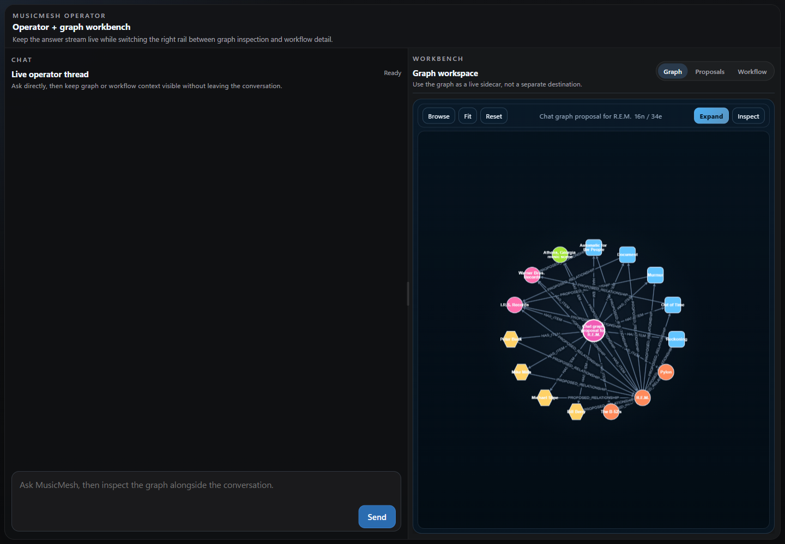
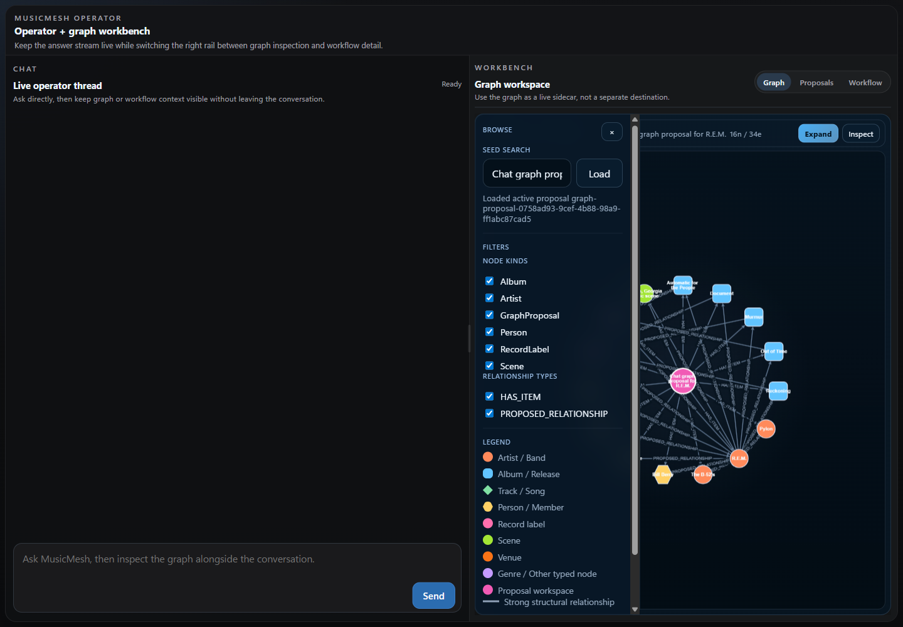

# Operator Graph Proposal Walkthrough

This walkthrough documents the corrected proposal graph behavior after the duplicate-looking proposal flow.

## 1. Start From The Operator Workbench

Open the local app:

```powershell
npm run dev:api
npm run dev
```

Then load:

```text
http://127.0.0.1:3000/
```

The default screen is the MusicMesh operator workbench. The graph panel loads the most recent proposal for the active thread when one is available.



## 2. Confirm The Graph Is Showing Domain Nodes

Open **Browse** in the graph toolbar.

The node filters should now show music-domain kinds, not only proposal wrapper kinds:

- `Album`
- `Artist`
- `GraphProposal`
- `Person`
- `RecordLabel`
- `Scene`

The important correction is that proposal entity items are displayed using their intended proposed domain kind. For example, a proposed R.E.M. artist item is colored and filtered as `Artist`, not as a generic `ProposalItem`.



## 3. Understand What Is Hidden

The graph still keeps proposal workspace structure in the database, but the visual graph no longer draws `ProposedRelationship` items as entity nodes.

That means labels such as:

- `R.E.M. MEMBER_OF Michael Stipe`
- `R.E.M. RELEASED_ALBUM Murmur`
- `R.E.M. ASSOCIATED_WITH_SCENE Athens, Georgia music scene`

should appear as relationships or relationship context, not as circular nodes.

## 4. Color Rules

The graph uses domain color coding:

- Artist / band: orange
- Album / release: blue
- Person / member: yellow
- Record label: pink
- Scene: green
- Proposal workspace: magenta
- Generic or other typed nodes: purple

This makes proposal graphs readable while preserving the distinction between proposed workspace structure and music entities.

## 5. LLM Interpretation Rule

Entity interpretation belongs to the LLM, not regex or brittle prompt parsing.

The proposal system now instructs the LLM to:

- treat submitted terms as operator intent, not automatically as graph nodes
- use questions or search phrases to guide discovery
- avoid creating candidate nodes for task phrases
- resolve aliases and informal input to the best music-domain entity
- prefer `R.E.M.` as an `Artist` over a generic `Entity` named `REM`

If the LLM or proposal generator cannot complete that interpretation, the system asks for human input instead of inventing entities deterministically.

## 6. Human-In-The-Loop Failure Rule

When graph tooling gets stuck, the assistant should ask the user what to do next.

Good next-step options include:

- retry with a narrower entity list
- inspect canon first
- clarify whether the phrase is a search request or a graph entity
- continue with an answer but skip persistence

The system should not silently create generic entities from failed extraction.

## 7. Verification Evidence

For the current local graph payload:

- visible graph nodes: `16`
- visible graph edges: `34`
- visible node kinds: `Album`, `Artist`, `GraphProposal`, `Person`, `RecordLabel`, `Scene`
- hidden proposal relationship item nodes: `19`
- hidden proposal scaffold edges: `38`

The key result: proposal relationship descriptors are no longer drawn as entity nodes, and proposed entities are colored by their intended domain kind.
